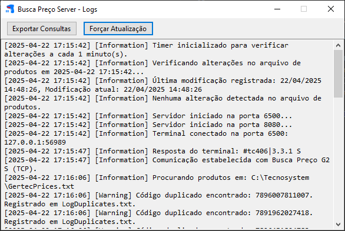

#   Busca Preço Server 


## Sobre o Projeto
O **Busca Preço Server** é uma aplicação desenvolvida para comunicar com o terminal de consulta de preços Gertec G2-S. A aplicação cria um servidor comunicando com o terminal via porta TCP aonde recebe o código de barras lido pelo equipamento e responde com a descrição do produto e seu preço, ou nfound quando não encontrado nenhum produto correspondente aquele código.

A aplicação permite que o usuário configure, através de um arquivo config.ini na pasta raiz, a porta de comunicação (caso deseje conectar mais de um equipamento na variável 'Porta', pode-se incluir as portas separadas por vírgula, ex. 6500,6501,6502,etc.).

Pelo mesmo arquivo é possível configurar o caminho em que se localiza o arquivo txt com os códigos, descrições e valores dos produtos (ex. 123456789|PRODUTO TESTE|10,99) na variável 'CaminhoArquivo'.

E também é possível configurar o tempo, em minutos, em que a aplicação irá verificar se o arquivo de texto foi modificado (alteração, inclusão ou exclusão de produtos e valores) para atualizar a memória dos dados, na variável 'TempoAtualizacaoMinutos'.

A aplicação conta também com um arquivo em sua raiz nomeado de produtos.txt, que é constantemente atualizado com o conteúdo do arquivo principal de produtos. Caso a aplicação não encontre o arquivo principal, é consultado este arquivo e o terminal continua operando.

## Tecnologias Utilizadas
- **C#**: Linguagem de programação principal utilizada para o desenvolvimento da lógica do servidor.
- **.NET 8**: Framework utilizado para construir a aplicação, oferecendo suporte a funcionalidades modernas e desempenho otimizado.
- **Serilog**: Biblioteca de logging para registro de eventos e monitoramento da aplicação.

## Como Executar o Projeto
Siga os passos abaixo para executar o projeto em sua máquina. Estas instruções são destinadas a pessoas sem experiência técnica prévia.

### Pré-requisitos
- Instale o **.NET 8 SDK** no seu computador. Você pode baixá-lo no site oficial da Microsoft: [Download .NET 8](https://dotnet.microsoft.com/download/dotnet/8.0).
- Um terminal (como o Prompt de Comando no Windows, Terminal no macOS/Linux ou qualquer outro de sua preferência).

### Passo a Passo
1. **Baixe o projeto**:
   - Faça o download do código-fonte do projeto (ou clone o repositório, se souber usar Git).
   - Extraia os arquivos para uma pasta de sua escolha.

2. **Abra o terminal**:
   - Navegue até a pasta do projeto no terminal. Por exemplo, se a pasta do projeto está em `C:\Projetos\BuscaPrecoServer`, digite:
     ```bash
     cd C:\Projetos\BuscaPrecoServer
     ```

3. **Restaure as dependências**:
   - Execute o comando abaixo para baixar todas as bibliotecas necessárias:
     ```bash
     dotnet restore
     ```
   - Aguarde até que o processo termine. Você verá mensagens indicando que as dependências foram restauradas.

4. **Compile o projeto**:
   - Execute o comando para compilar o projeto:
     ```bash
     dotnet build
     ```
   - Isso verificará se o código está correto e gerará os arquivos necessários para execução. Certifique-se de que não há erros.

5. **Execute a aplicação**:
   - Execute o comando para iniciar o servidor:
     ```bash
     dotnet run
     ```
   - A aplicação será iniciada e permanecerá minimizada na barra de tarefas (tray) com o ícone azul piscando em vermelho (leitor de código de barras).

6. **Acesse a aplicação**:
   - Através de dois cliques sobre o ícone ou um clique com o botão direito do mouse e selecionada a opção Exibir Logs, será aberta a tela de logs da aplicação.
   - Nesta tela é possível acompanhar o andamento da aplicação, como o acesso ao arquivo de produtos, a ataulização da listagem dos dados, as portas em que estão sendo 'escutadas' para comunicação, os equipamentos que forem conectados e as consultas realizadas.
   - É possível, através do botão 'Forçar Atualização', fazer com que o sistema leia o arquivo principal, atualizando sua base de dados a qualquer momento sem ser necessário aguardar o timer ser executado.
   - Através do botão Exportar Consultas é gerado na pasta raiz um arquivo de texto com um resumo das consultas realizadas durante o período em que o serviço estiver rodando.
   - A aplicação gera também um arquivo de logs na pasta raiz, chamado LogDuplicates, aonde traz os produtos com código duplicado e as descrições e valores que foram adotados.

6. **Encerrar a Aplicação**:
   - Para encerrar a aplicação podemos estar clicando com o botão direito do mouse no ícone na bandeija e selecionando a opção Sair.

### Solução de Problemas
- **Erro no `dotnet restore` ou `build`**: Verifique se o .NET 8 SDK está instalado corretamente. Tente reinstalar se necessário.
- **Erro no `dotnet run`**: Certifique-se de que não há outro programa usando a mesma porta (como 5000). Você pode tentar parar outros serviços ou reiniciar o computador.
- **Dúvidas gerais**: Consulte a documentação oficial do .NET ou entre em contato com o desenvolvedor do projeto.

### 
